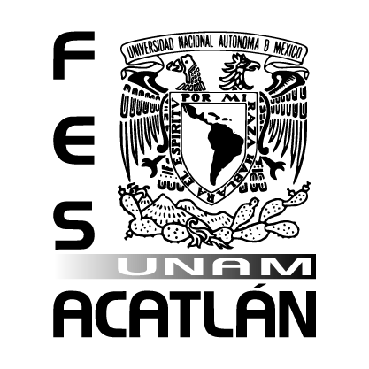
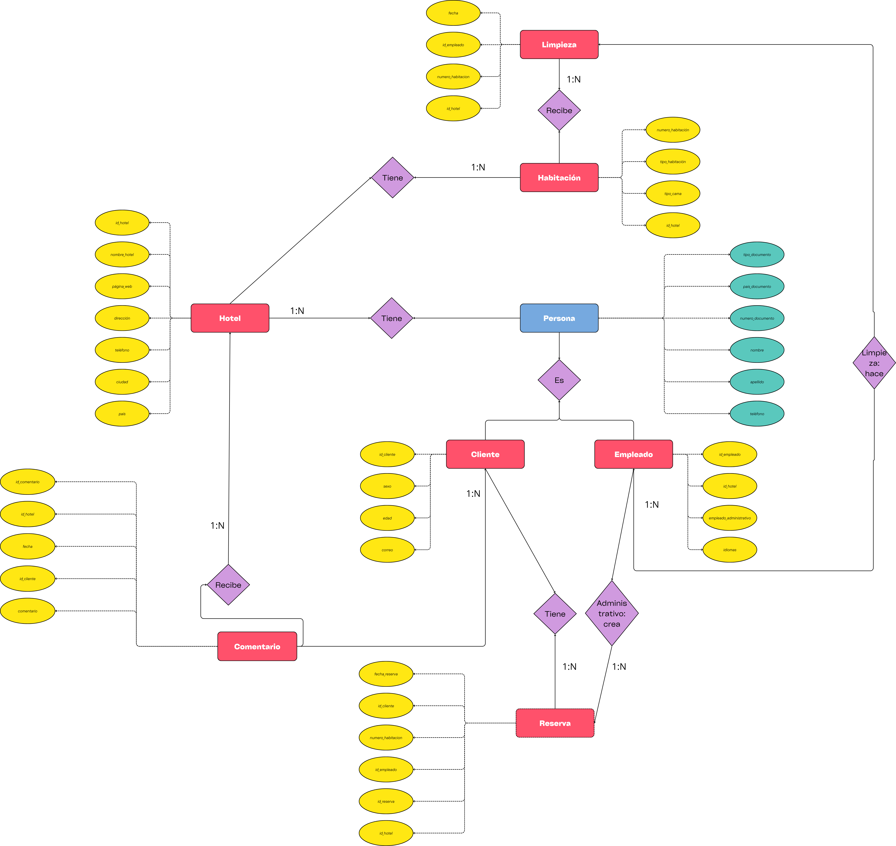
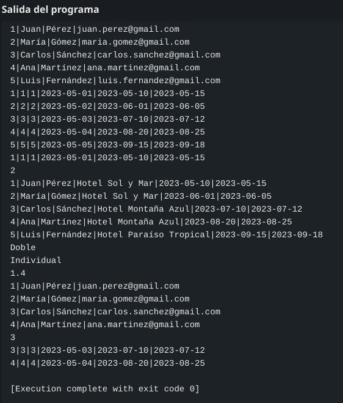

<!-- 

# Trabajo Final. Base de Datos
Trabajo final de la materia de Base de datos, impartida por la *Dr. Loza Pacheco Lourdes*
## Integrantes
GRUPO: 2403 -->

    

<h1 align="center">UNIVERSIDAD NACIONAL AUTÓNOMA DE MÉXICO</h1>
<h2 align="center">Facultad de Estudios Superiores Acatlán</h2>
<h3 align="center">Matemáticas Aplicadas y Computación</h3>

<h3 align="center">Trabajo Final. Base de Datos</h3>

Trabajo final de la materia de Base de datos, impartida por la <em>Dr. Loza Pacheco Lourdes</em>

## Integrantes
GRUPO: 2403

- BELTRÁN ISIDRO CARLOS FABIAN - 423127045
- BOLAÑOS DE LA O MARIA FERNANDA - 423020269
- DÍAZ VALDEZ FIDEL GILBERTO - 320324280
- PINTO VEIZAGA FRIDA - 423490440
- RODARTE ROSALES JESUS EDUARDO - 319264553

### Modelo Entidad - Relación

    

#### Capturas de la ejecución del código

    

